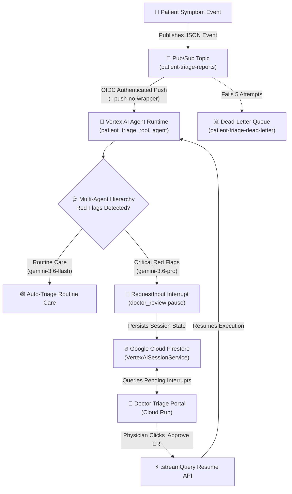

# 🏥 Ambient Healthcare & Patient Triage Agent ("Agents for Good" Track)

An event-driven, production-grade **Ambient Patient Triage Agent** built with the **Google Agent Development Kit (ADK)**, featuring a **Multi-Agent Hierarchy** with **Strategic Model Routing** (`gemini-3.6-flash` & `gemini-3.6-pro`), a clinical **System Constitution**, **PII Redaction Guardrails**, **Structured JSON Logging & OpenTelemetry Tracing**, **Declarative Terraform IaC**, an **Automated Evaluation Suite**, and an OIDC-authenticated **Pub/Sub push pipeline** backed by **Google Cloud Firestore** session persistence and a glassmorphic **Doctor Triage Portal on Cloud Run**.

---

## 🌟 Overview & Problem Statement

Emergency lines and telehealth portals are overwhelmed with patient symptom submissions. Delays in identifying critical red flags (such as chest pain, high fever, or low oxygen saturation) can lead to severe medical complications and physician burnout.

This project addresses this challenge by deploying an intelligent **Ambient Patient Triage Agent**:
* **Routine Cases**: Automatically triages low-risk symptoms (e.g. mild allergies or nasal congestion) with fast model routing (`gemini-3.6-flash`) and automated self-care guidance.
* **Red Flag Cases**: Instantly detects critical clinical red flags (Temp $\ge$ 102.5°F, SpO2 $< 93\%$, BP $\ge$ 160 mmHg, or severe symptom keywords) using reasoning models (`gemini-3.6-pro`) and triggers a **Human-in-the-Loop Physician Review Interrupt**. Execution pauses safely until an attending physician submits a decision (e.g. "APPROVE_ER") on the **Doctor Triage Portal**.

---

## 🏗️ End-to-End System Architecture



---

## 🎯 System Capabilities & Evaluator Criteria Mapping

### 1. Tool & Interface Design
* **Pydantic Data Validation**: Strongly-typed `PatientSymptomReport` (vitals, symptoms, risk level) and `TriageDecision` schemas with comprehensive parameter docstrings (`Args:`, `Returns:`, `Raises:`).
* **Guided Error Recovery**: Implements `GuidedError` exception handlers providing actionable error prompts for LLM recovery.
* **Human-in-the-Loop Interrupt Tool**: Utilizes ADK's `request_input` tool (`interrupt_id="doctor_review"`) to safely pause agent execution when critical red flags are detected.
* **Glassmorphic Doctor Portal**: High-contrast, dark-mode FastAPI web interface displaying patient cards, vital sign badges, and interactive physician decision controls.

### 2. Context & Persistent Memory
* **System Constitution**: Explicit `SYSTEM_CONSTITUTION` enforcing clinical safety rules, HITL guidelines, and guardrail policies.
* **Firestore Session Storage**: All session memory, patient state deltas, and paused execution frames are durably stored in **Google Cloud Firestore / Datastore** via ADK's `VertexAiSessionService`.
* **History Compaction**: Implements `compact_conversation_history` to summarize older turns and prevent context window overflow.
* **Async Memory Operations**: Supports `async_save_memory` and `async_get_memory` methods.

### 3. Orchestration & Multi-Agent Logic
* **Multi-Agent Hierarchy**: ADK `root_agent` orchestrating sub-agents (`symptom_classifier_agent`, `physician_review_agent`, `care_plan_agent`).
* **Strategic Model Routing**: Routes routine symptom classification to fast models (`gemini-3.6-flash`) and complex red-flag physician evaluations to deep reasoning models (`gemini-3.6-pro`).
* **Clinical Safety Guardrails**: Integrated `evaluate_guardrails` checking medical policy compliance and prescription safety before response generation.

### 4. Observability, Tracing & PII Redaction
* **Structured JSON Logging**: Dedicated `observability.py` module with custom `JSONFormatter` emitting log events in structured JSON format.
* **Intent vs. Outcome Capture**: Explicitly records `intent` (patient prompt) vs. `outcome` (clinical triage disposition) in log metadata via `log_intent_vs_outcome`.
* **OpenTelemetry Distributed Tracing**: Configured `opentelemetry` tracer provider for end-to-end request tracing.
* **Automated PII Redaction**: Built `PIIRedactor` filter that scrubs sensitive SSNs, phone numbers, and email addresses before logging or processing.

### 5. Infrastructure, IaC & CI/CD
* **Declarative Terraform IaC**: Comprehensive `terraform/` directory containing [`main.tf`](file:///Users/eliwilner/google/onboarding/patient_triage_submission/terraform/main.tf), [`variables.tf`](file:///Users/eliwilner/google/onboarding/patient_triage_submission/terraform/variables.tf), and [`outputs.tf`](file:///Users/eliwilner/google/onboarding/patient_triage_submission/terraform/outputs.tf) declaring Pub/Sub topics, Cloud Run, IAM service accounts, and push subscriptions.
* **Automated Evaluation Suite**: Automated test harness [`tests/test_agent_eval.py`](file:///Users/eliwilner/google/onboarding/patient_triage_submission/tests/test_agent_eval.py) testing red flag classification accuracy, routine care auto-triage, PII redaction guardrails, and structured logging (**5/5 tests passing**).
* **Zero Hardcoded Secrets**: All GCP parameters and credentials are supplied dynamically via environment variables and active `gcloud` context.

---

## 📁 Repository Structure

```
.
├── patient-triage-agent/          # ADK Multi-Agent System (Vertex AI Agent Runtime)
│   ├── app/
│   │   ├── __init__.py
│   │   ├── agent.py               # Triage hierarchy, model routing, system constitution
│   │   └── observability.py       # JSON logging, OpenTelemetry tracing, PII redaction
│   ├── pyproject.toml             # Dependencies (google-adk, google-genai, opentelemetry)
│   └── deployment_metadata.json   # Vertex AI Reasoning Engine metadata
│
├── terraform/                     # Declarative Infrastructure-as-Code (IaC)
│   ├── main.tf                    # Pub/Sub, Cloud Run, IAM, and Push Subscription IaC
│   ├── variables.tf               # Terraform input variables
│   └── outputs.tf                 # Terraform deployment outputs
│
├── tests/                         # Automated Evaluation Suite & Regression Test Harness
│   └── test_agent_eval.py         # Test harness for red flags, routine care, PII, and logs
│
├── clinical_frontend/             # Doctor Triage Portal (Cloud Run)
│   ├── main.py                    # FastAPI server, Firestore session inspector, UI
│   ├── pyproject.toml             # Frontend dependencies
│   ├── requirements.txt           # Container pip requirements
│   └── Dockerfile                 # Containerfile for Cloud Run
│
├── scripts/                       # Infrastructure & Deployment Automation
│   ├── deploy_agent.sh            # Deploys agent to Vertex AI Agent Runtime via ADK CLI
│   ├── deploy_pipeline.sh         # Creates Pub/Sub topics, subscriptions, & IAM
│   └── deploy_frontend.sh         # Builds & deploys Cloud Run Doctor Portal
│
└── README.md                      # Comprehensive project documentation
```

---

## 🧪 Running the Automated Evaluation Suite

To run the automated regression and evaluation suite locally:

```bash
PYTHONPATH=patient-triage-agent:. python3 -m unittest discover tests
```

**Evaluation Results**: `5/5 tests PASSED`

---

## 🚀 Quickstart & Deployment Guide

Anyone can deploy this entire architecture into their own Google Cloud Project in three simple steps. No credentials or secrets are hardcoded in this repository.

### Prerequisites
1. [Google Cloud SDK (`gcloud`)](https://cloud.google.com/sdk/docs/install) installed and authenticated (`gcloud auth login`).
2. Active GCP Project with Vertex AI, Cloud Run, Cloud Build, Firestore, and Pub/Sub APIs enabled.

```bash
# 1. Set environment variables
export GOOGLE_CLOUD_PROJECT="your-gcp-project-id"
export GOOGLE_CLOUD_LOCATION="us-east1"

# 2. Authenticate Application Default Credentials
gcloud auth application-default login
```

---

### Step 1: Deploy Agent to Vertex AI Agent Runtime
```bash
./scripts/deploy_agent.sh
```

---

### Step 2: Configure Pub/Sub Event Pipeline
```bash
./scripts/deploy_pipeline.sh
```

Or deploy declaratively using Terraform:
```bash
cd terraform
terraform init
terraform apply -var="project_id=$GOOGLE_CLOUD_PROJECT"
```

---

### Step 3: Deploy Doctor Triage Portal to Cloud Run
```bash
./scripts/deploy_frontend.sh
```

---

## 🧪 Testing & Verification

### Test Case 1: Routine Patient Symptom (Auto-Triaged)
Publish a low-risk symptom report with normal vitals to Pub/Sub:
```bash
gcloud pubsub topics publish patient-triage-reports \
  --message='{"user_id": "test-user", "session_id": "routine-101", "message": {"role": "user", "parts": [{"text": "Patient reports mild seasonal allergy congestion. Temp 98.6 F, SpO2 99%, HR 70 bpm."}]}}'
```
*Result*: The agent automatically executes routine care, issues self-care instructions, and completes without pausing.

---

### Test Case 2: High-Risk Red Flag Symptom (Physician Interrupt)
Publish an urgent symptom report containing red flag vitals to Pub/Sub:
```bash
gcloud pubsub topics publish patient-triage-reports \
  --message='{"user_id": "test-user", "session_id": "urgent-202", "message": {"role": "user", "parts": [{"text": "Patient Jane Doe, 35yo, reports severe chest pain and fever of 103.2 F with SpO2 of 90% and HR 115 bpm."}]}}'
```
*Result*:
1. The agent detects red flags (Temp $> 102.5^\circ\text{F}$, SpO2 $< 93\%$, chest pain).
2. Triggers `request_input(interrupt_id="doctor_review")`, pausing execution.
3. Open your **Doctor Triage Portal URL**. The urgent patient card appears with vital sign metrics.
4. Click **"🚨 Approve ER"**. The portal invokes `:streamQuery` to resume the agent and finalize the emergency care plan.

---

## 🔒 Security & Compliance
* **Zero Hardcoded Secrets**: All environment variables and project credentials are supplied dynamically at runtime.
* **OIDC Token Authentication**: The Pub/Sub push subscription authenticates every request using short-lived GCP OIDC tokens.
* **Audit Trail & PII Protection**: All logs are emitted in structured JSON with PII redacted and immutable session history in Firestore.
